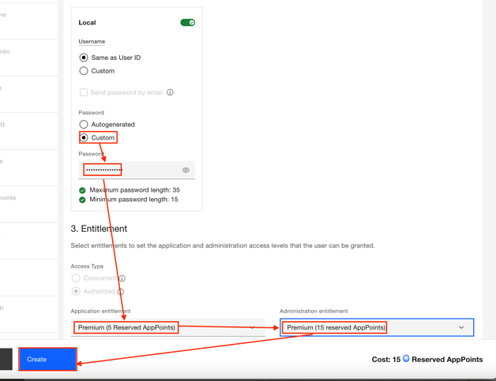
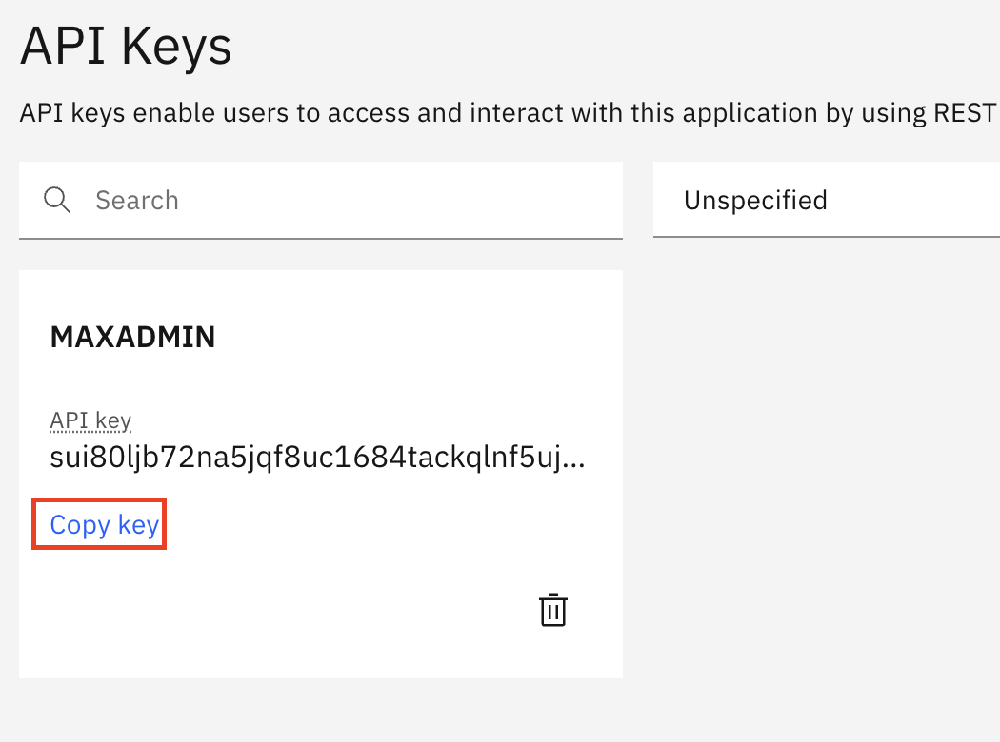

[Previous](./01_introduction_overview.md) | [Next](./03_cluster_and_admin_setup.md)

# **Module 2: Build and Setup**

### **3. Job Plan / Preventive Maintenance Activity**  
The Maintenance Manager/Planner should provide a job plan that includes materials, tasks, and inspection items for Maximo Mobile demos.

---

## **Build**

### **Cluster Preparation**
*This needs adjustment to use the basic TechZone MAS resource.*

This lab requires **Maximo Manage + Health**. Maximo Mobile is included with Manage. **Avoid using client environments** for POCs—this adds complexity without additional business value.

**TechZone Options:**
- **MAS V2 + Manage (Pre-installed)**  
    Includes Maximo Manage & Health, with validated certificates.

- **TechZone Provisioned RHOS Cluster**  
    - Worker Nodes: 3  
    - Worker Node Flavor: `b3c.16X64.300gb` (16 vCPU, 64GB RAM, 300GB storage)  
    - ODF Size: 2TB  
    - *Note: Manual MAS installation required. Certificates require DNS configuration.*

---

## **Access the Application Suite**

Using **MAS V2 + Manage – TechZone Certified Base Image**:

---

### **Step 1: Access Routes**
Access OpenShift → **Networking → Routes**  

---

### **Step 2: Filter by Core Project**
Filter by **core** project (`mas-{instanceid}-core`)  

---

### **Step 3: Access Suite Admin URL**
Click the `{instanceid}-admin` URL for Suite Admin page.  

---

### **Step 4: Find Superuser Credentials**
Expand **Workloads**, then click **Secrets**.  

---

### **Step 5: Locate Superuser Password**
Filter by **superuser**, open MAS Core Superuser password.  

---

### **Step 6: Login**
Login using provided credentials.  

---

## **Create Admin Users**

### **Step 1: Select Users Application**

---

### **Step 2: Search and Select MAXADMIN**

---

### **Step 3: Edit MAXADMIN Details**
Add email, click **Replace Forgotten Password**.  

---

### **Step 4: Update Password**
Set password to Superuser password for easy reference.  

---

### **Step 5: Create Personal Admin Account**
Click **+** in left panel.  

---

### **Step 6: Provide Details**
Fill in name, username, email, and assign entitlements.  

---

### **Step 7: Assign Roles**
Set password or use auto-generated one. Grant both **Premium Application** and **Premium Admin** entitlements.  

---

### **Step 8: Log out and log back in as the MAXADMIN user**

---

### **Step 9: From the Suite Navigator page, click on the ‘Manage’ application**

---

### **Step 10: Open the ‘Security Groups’ application, using one of the Start Center quick links**

---

### **Step 11: Filter for the MAXADMIN security group, and select to open**

---

### **Step 12: Click on the ‘Users’ tab**

---

### **Step 13: Use the plus button to add a new user record, add your username, then save the record**

---

### **Step 14: Logout and log back in as your personal admin user**

---

## **Prepare Maximo Manage**

The following steps need to be accomplished to avoid errors during a Maximo Mobile demonstration. These are standard steps for all Maximo environments:

---

### **Step 1. When logged in as your admin user, from Maximo Manage, select the user icon → ‘Default Information’**

---

### **Step 2. Select ‘Bedford’ as your default insert site, default storeroom site, and ‘Central’ as your default storeroom.**  
‘Bedford’ is our Demo site with most of the Demo data. Sites are often used as primary keys and define required business workflows that differ between client groups. Many Maximo functions require this to be set.

---

### **Step 3. Navigate to the ‘System Properties’ application using the Internal Application Navigator**

---

### **Step 4. Find the `mxe.oslc.webappurl` system property by clicking the filter button and typing in the property name.**  
Note: Many tables in Maximo appear empty until you click **Enter** on a filter. This property connects mobile.

---

### **Step 5. Update the current value to the Maximo Manage URL**

---

### **Step 6. Save the record, check the box next to the updated property, and perform a ‘Live Refresh’**

---

### **Step 7. Click ‘OK’ to update the system property**

---

### **Step 8. Find `mxe.externaleam.url` and update it to the Maximo Manage URL (with `/maximo`). Save, check, and refresh.**  
This allows linking Health to Manage.

---

### **Step 9. Populate the API key. Navigate to the API key application.**

---

### **Step 10. Create an API key for the MAXADMIN user without an expiration.**  
Since this API key is system-wide, using a default admin user is best practice.

---

### **Step 11. Copy the API key and return to System Properties to update `mxe.externaleam.apikey`. Save and refresh.**

---

### **Step 12. Navigate to the ‘Chart of Accounts’ application**

---

### **Step 13. From the More Actions panel, select ‘Validation Options’**

---

### **Step 14. Turn on "Deactivate GL Validations" and click ‘OK’.**  
*Note: GL Validations are critical for taxes and finance tracking but require extra setup and are unnecessary for most Maximo demos.*

---

### **Give Permission to access Health Module**  
Using the External Application Navigator.

if you had not included these as part of security group the user has access to upon creation, follow these steps.

---

### **Step 1. Naviagate to Users from Manage**  
Then search and click into your user's name

---

### **Step 2. Authorize Group Assignment**  
Search for total of 8 security groups. Once by searching "Health" as Name, another time by searching "Health" as Description

---

### **Step 3. Select Security Groups**  
Navigate to "Groups" tab then click "Select Groups" to add all 8 security groups.

---

[Previous](./01_introduction_overview.md) | [Next](./03_cluster_and_admin_setup.md)
