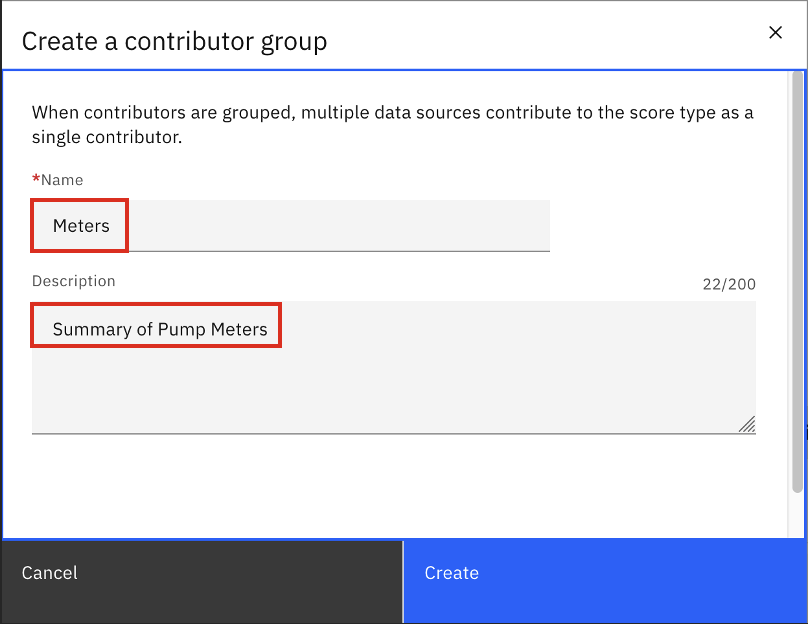
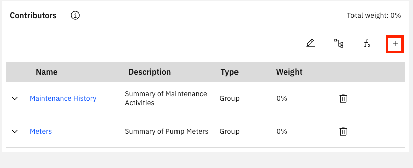

[Previous](./03_creating_health_scores.md) | [Next](./05_creating_health_views_and_mobile_access.md)

# **Module 4: Create Health Scores Continued**

---

### **Step 8: Review Context**
Now that all contributors have been created, we can create the **Health Scores**.  
(*Note:* “Health Scores” typically include **Health**, **Risk**, and **Criticality**.  
Custom scores can also be created for additional scoring types.)

---

### **Step 9: Navigate to Your Scoring Group**
Go to the **Scoring Group** you created earlier.

---

### **Step 10: Select the Scoring Group**
Choose the group you created.

---

### **Step 11: Click ‘Add Score’**
Click the **Add Score** button.

---

### **Step 12: Select Health Score**
Select **Health** and click **Done**.  
(*Choose the blank Health score instead of default.*)

---

### **Step 13: Create Contributor Groups**
Contributor Groups allow multiple contributors to roll up into a component of the score.  

We will create:
- **Maintenance History**
- **Meter History**

Click the **Group** button (top right of Contributors chart).

---

### **Step 14: Create First Group**
- **Name:** {FirstInitial_First3LettersOfLastName} Maintenance History  
- **Description:** Summary of Maintenance Activities  
Click **Create**.

---

### **Step 15: Create Second Group**
*Use Group button again*
- **Name:** {FirstInitial_First3LettersOfLastName} Meters  
- **Description:** Summary of Pump Meters  
Click **Create**.

---

### **Step 16: Add Contributors**
- Open **Maintenance History** group.
- Click the **+** button (top right).

---

### **Step 17: Select Contributors**
- **Search for and select OPENCMWO**
- **Mean Time between Failures (MTBF)  --> search for {FirstInitial_First3LettersOfLastName}MTBF**
- **Total Cost of CMs --> {FirstInitial_First3LettersOfLastName}TCCM**

Click **Add**.

---

### **Step 18: Edit Weights**
Click the **Pencil** icon (top right) to edit weights.  
All weights within a group must total **100%**.

---

### **Step 19: Assign Weights**
- **MTBF:** 50%  
- **Total Cost of CMs:** 10%  
- **OPENCMWO:** 40%  

Click **Save**.

---

### **Step 20: Repeat for Meter Group**
Go back to the Previous Page using the Breadcrumb Menu and the top and repeat for the **Meters** group.

For the **Meters** group, use the following contributors and weights:
- **Temperature:** 15%  
- **Oil Quality:** 50% 
- **Pressure:** 35%

*Note: We suggest searching for your {FirstInitial_First3LettersOfLastName} to populate all contributors made by you

---

### **Step 21: Add Remaining Useful Life (RUL)**
Navigate to the Health Score configuration page, and add the **RUL (Remaining Useful Life)** contributor to the Health Score using the **plus** button in the top right.

---

### **Step 22: Edit Weights**
Use the **Pencil** icon to edit the weights of the final Health Score.

---

### **Step 23: Activate Health Score**
Click the **Active** button in the top right to enable the health score.

---

### **Step 24: Repeat for Criticality and Risk**
Return to the **Health Score Group** page by clicking PUMPS FOR CLIENT for client in the breadcrumb menu and repeat the process for **Criticality** and **Risk**.  
These will not need contributor groups; all scores will be at the top level.

---

### **Step 25a: Criticality**

-Press the + to add a score

Select Critacilty and click Done.  
(Choose the blank Criticality score instead of default.) 

- Open Criticality group.  
- Click the + button  

Add Contributors with the + button / Set the weights with the pencil button
  - Priority – 60%  --> this is a premade contributor
  - Cost of Replacement – 40%   --> search for {FirstInitial_First3LettersOfLastName}ECR

Click the Active button in the top right to enable the Criticality score.

---

### **Step 25b: Risk**

Return to the **Health Score Group** page by clicking PUMPS FOR CLIENT for client in the breadcrumb menu

Select Risk and click Done.  
(Choose the blank Risk score instead of default.)  

- Open Risk group.  
- Click the + button (top right)  

Select Contributors / Set Weights
- {FirstInitial_First3LettersOfLastName}Health – 70%
- {FirstInitial_First3LettersOfLastName}Criticality – 30%

Click the Active button in the top right to enable the Criticality score.

---

### **Step 26: Force Score Calculation**
Click the *Calculate Scores* button at the top if scores do not calculate automatically. (Refresh the page to see the scores) If you see a red circle on the scores, that means it did not calculate properly. To troubleshoot, take these actions:
- Create a **test contributor**, add it to the score with 0% weight.
- Start with a **count function** on the relationship and confirm it returns a value.
- Gradually add components of the formula.
- If no result, validate the relationship by:
    - Replacing dynamic values (e.g., `:assetnum`) in the **where clause**.
    - Test the query in the child object application.

---

## **Create Health View**

### **Step 1: Navigate to Asset Health Page**

---

### **Step 2: Click Filter (Top Right)**

---

### **Step 3: Edit Query**
Click the pencil icon and select the query created for the Health Scoring Group. Serach for {FirstInitial_First3LettersOfLastName}-PUMPS

---

### **Step 4: Apply Filter**

---

### **Step 5: Switch to Matrix View**
Click the **Matrix View** button (top right).

---

### **Step 6: Confirm Dropdown**
Ensure it says **Criticality and Health**.

---

### **Step 7: Configure Settings**
Click the **Settings Cog** (top right).

---

### **Step 8: Toggle Default View**
Enable **Default**, then click **Save**.

---

### **Step 9: Save Personal View**
Use the dropdown in the top left → **Save as New View**.

---

### **Step 10: Provide Title**
Title = {FirstInitial_First3LettersOfLastName} POC Pumps
Select **Save as my Default View**, then click **Save**.

---

**Tip:** For client POCs, ensure at least one asset falls in the **red zone**, signaling it needs immediate attention.

---

[Previous](./03_creating_health_scores.md) | [Next](./05_creating_health_views_and_mobile_access.md)
